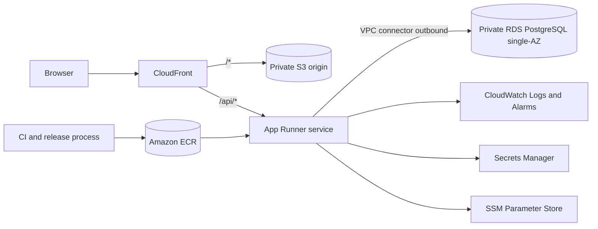

# ADR-0001: Initial HomeOps AWS Development Architecture

- Status: Accepted
- Date: 2026-08-09

## Context

HomeOps now has a validated local full-stack slice:

- React and Vite frontend
- Spring Boot Java 21 backend packaged as a Docker image
- PostgreSQL 16.14 with Flyway migrations and Hibernate ddl-auto validate
- CI checks for backend verify, frontend test and build, and backend container image build
- Playwright E2E for one real browser journey

Issue #59 requires selecting the initial AWS development runtime and hosting architecture for a small MVP with low traffic, controlled development usage, and no production users yet.

The selected architecture must remain simple, secure, and low cost while preserving:

- single-backend service boundary
- environment-driven configuration
- private database access
- Flyway as schema owner
- future ability to migrate to a different managed runtime if deeper control is needed

No AWS resources are provisioned by this decision. Provisioning is deferred to future Terraform implementation stories.

## Constraints

- Security first: private data stores, least privilege, no public database access.
- Simplicity second: avoid orchestration complexity that is not required at current scale.
- Low recurring cost target: generally about $30-65/month for an always-available dev environment, potentially lower when resources are paused or stopped.
- Professional architecture: managed services preferred, clear boundaries, observable runtime.
- Current product limitation: authentication and authorization are not yet implemented.
- Explicitly avoid for first slice:
  - EKS and Kubernetes
  - NAT Gateway
  - unnecessary ALB usage
  - public RDS
  - multi-region
  - premature high availability patterns

## Decision

Adopt the following initial AWS development architecture:

- Frontend hosting:
  - private S3 origin behind CloudFront
  - CloudFront routes /* to S3
  - CloudFront routes /api/* to the backend origin to preserve same-origin browser behavior
- Backend runtime:
  - AWS App Runner using the existing backend Docker image
- Container registry:
  - Amazon ECR
- Database:
  - private single-AZ Amazon RDS for PostgreSQL
- Private database connectivity:
  - App Runner uses a VPC connector for application outbound connectivity to private RDS
- Secrets and configuration:
  - Secrets Manager for database credentials
  - SSM Parameter Store (standard parameters) for non-secret runtime configuration
- Observability:
  - CloudWatch logs and basic alarms
- Infrastructure as code:
  - Terraform will provision the AWS development environment in later stories

## Options Considered

### Option A: CloudFront + S3 + App Runner + ECR + private single-AZ RDS (selected)

Pros:

- smallest managed-container operational model for current MVP
- preserves current Docker backend contract
- straightforward same-origin browser architecture through CloudFront path routing
- clear private database boundary using VPC connector and security groups
- avoids NAT Gateway in first slice

Cons:

- less runtime and networking control than ECS/Fargate
- future migration may be needed if networking or deployment needs become more complex

### Option B: CloudFront + S3 + ECS on Fargate + ECR + private single-AZ RDS

Pros:

- deeper runtime, network, and deployment control
- strong long-term fit for complex service meshes or advanced traffic patterns
- direct path to richer platform capabilities

Cons:

- higher operational and networking complexity at current scale
- typically higher baseline recurring cost for equivalent MVP behavior
- pushes the project into earlier orchestration decisions than required now

### Option C: CloudFront + S3 + Lightsail Containers + managed database

Pros:

- simple getting-started experience
- can be low cost for small workloads

Cons (reason not selected):

- weaker alignment with the current container and security posture expectations
- less direct fit for private-RDS-plus-VPC security model used by current decision
- lower long-term continuity with the managed-runtime path expected for later growth

## App Runner vs ECS/Fargate Comparison

- Simplicity:
  - App Runner is simpler for first deployment
  - ECS/Fargate requires more infrastructure surfaces
- Operational burden:
  - App Runner lower
  - ECS/Fargate higher
- Docker compatibility:
  - both are strong
- Networking control:
  - App Runner lower
  - ECS/Fargate higher
- Database connectivity:
  - both support private RDS connectivity patterns
- Cost at current scale:
  - App Runner path is generally lower for this MVP shape
  - ECS/Fargate often carries higher baseline for similar behavior
- Migration risk:
  - moving from App Runner to ECS/Fargate later is feasible and accepted as a planned tradeoff

## Networking Behavior and VPC Connector Implications

- App Runner VPC connector is used for outbound application traffic to private resources such as RDS.
- Inbound HTTPS traffic to App Runner is still through App Runner's public service endpoint.
- App Runner managed control-plane actions are managed by the platform and not intended as app-level VPC egress design.
- No NAT Gateway is used in the first slice.
- This is viable because current backend behavior only requires private database connectivity and does not require general internet egress through private subnets.

## Same-Origin CloudFront /api/* Routing and CORS

- CloudFront path routing is configured so browser traffic stays same-origin:
  - /* -> S3 frontend origin
  - /api/* -> backend origin
- This preserves current frontend relative /api usage pattern from local development.
- Consequence:
  - browser-origin CORS complexity is significantly reduced for core API calls
  - if direct cross-origin calls are introduced later, explicit CORS policy changes will be required

## Private RDS and Security Group Model

- RDS is private, single-AZ, and not publicly accessible.
- RDS security group allows inbound PostgreSQL only from the App Runner VPC connector security group.
- No broad CIDR-based inbound DB access.
- Data protection remains in-transit and at-rest by managed AWS controls and service configuration.

## IAM, Secrets, and Configuration Approach

- Least-privilege IAM roles are required for runtime and deployment responsibilities.
- Database credentials are stored in Secrets Manager.
- Non-secret runtime settings are stored in SSM Parameter Store.
- Secrets and environment-specific values are not embedded into container images.

## Cost and FinOps Expectations

Estimated recurring cost for a generally available development environment is roughly $30-65/month, with lower totals possible when resources are paused or stopped where supported.

Expected largest baseline cost driver is RDS instance plus storage.

Potential surprise charges to monitor:

- sustained always-on runtime without usage
- data transfer growth through CloudFront and API usage
- log ingestion growth in CloudWatch
- additional environments that duplicate baseline resources

## Security Limitations at Current Product Stage

Authentication and authorization are not yet implemented. This architecture decision does not remove that product risk.

Implications:

- public exposure must remain limited and controlled
- avoid treating this environment as production-ready for real user data
- prioritize authn/authz implementation before broader exposure

## Consequences and Tradeoffs

Benefits:

- secure private database boundary
- same-origin browser model through CloudFront routing
- low-complexity managed runtime selection
- clear migration path to deeper runtime control if needed

Tradeoffs:

- less low-level control than ECS/Fargate in first slice
- accepted future migration cost if service complexity grows
- AWS resources remain unprovisioned until Terraform follow-up stories

## Future Migration Path to ECS/Fargate

If deeper runtime or networking control is needed, migrate backend runtime from App Runner to ECS/Fargate while preserving:

- CloudFront same-origin /api routing contract
- ECR image publishing pattern
- private RDS security-group model
- secrets and configuration storage approach

## Explicit Rejections for First Slice

Rejected now:

- EKS/Kubernetes
- NAT Gateway
- unnecessary ALB
- public RDS
- multi-region topology
- premature HA patterns

These are deferred until product scale, threat posture, and operational requirements justify additional cost and complexity.

## Component and Data-Flow Diagram

## Next Terraform Story Boundary

In scope for next Terraform story:

- CloudFront distribution with path-based origin routing
- private S3 origin for frontend artifacts
- App Runner service and runtime configuration
- ECR repository for backend image
- private single-AZ RDS PostgreSQL and subnet/security-group wiring
- App Runner VPC connector and required networking resources
- Secrets Manager and Parameter Store entries
- CloudWatch log group and basic alarms

Out of scope for next Terraform story:

- EKS
- NAT Gateway
- multi-region
- production HA architecture
- advanced WAF policy programs
- application feature changes

## Related Issues and Docs

- Issue #59: Decide initial AWS runtime and hosting architecture
- docs/architecture/overview.md
- docs/finops/aws-cost-guardrails.md
- docs/security/threat-model.md
- docs/adr/README.md
