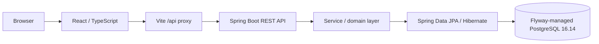
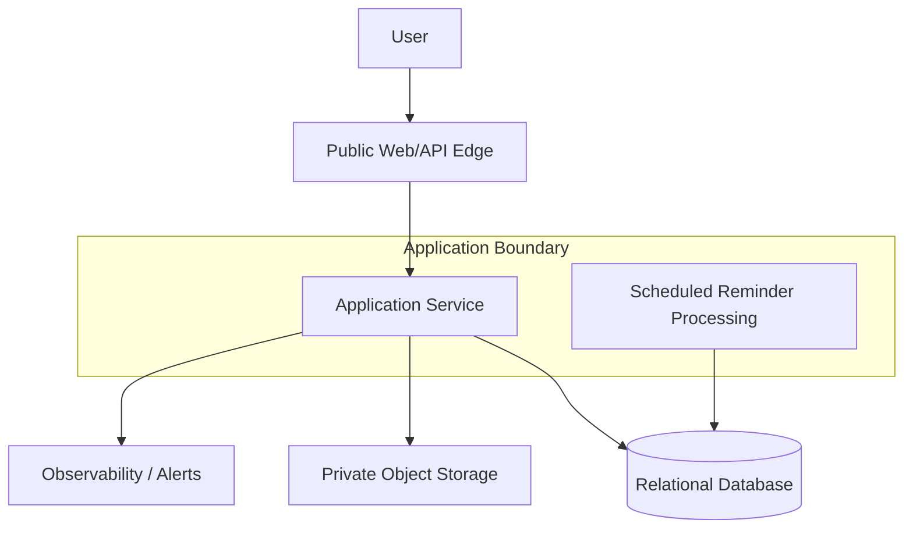

# HomeOps AI MVP Architecture Overview

## Purpose

This document provides a lightweight architecture overview for the HomeOps AI MVP. The goal is to support the core household ownership workflow in a way that is simple, secure, testable, and cost-conscious.

The design stays intentionally small and implementation-neutral so the team can later decide on a specific runtime, hosting model, and deployment pattern in separate architecture decisions.

## Architectural Goals

The MVP architecture should:

- support the core user journey from sign-in through asset, document, maintenance, and reminder management
- keep the system easy to operate at early usage levels
- protect household and document data with strong access boundaries
- keep structured data and documents in controlled storage
- avoid unnecessary complexity such as separate services for simple workflows
- remain extensible enough to support future AI-assisted features

## Proposed MVP Architecture

The MVP can be organized around a small set of core components:

- a web application for the primary user experience
- an application service for authentication, household and asset management, document handling, maintenance records, schedules, and reminders
- a relational database for structured records such as users, households, assets, maintenance events, schedules, and reminders
- private object storage for uploaded documents and images
- scheduled reminder processing for recurring maintenance logic and related notifications
- basic observability, logging, and alerting for operational visibility

## High-Level Runtime Model

The system should be treated as a single application boundary for the MVP. This keeps the initial implementation straightforward while still allowing later growth.

The public trust boundary contains the web/API edge. The database and object storage remain private resources and are only accessible through the application or other approved service identities.

Core responsibilities are:

- the web application handles user interaction
- the application service enforces business rules and data access
- the database stores structured application state
- object storage holds uploaded files and documents
- reminder processing runs as scheduled work within the same application boundary for MVP

## Current Validated Browser-to-Database Slice

Issue #43 established the first verified browser path through the HomeOps stack.

- Browser -> React / TypeScript -> Vite development proxy -> Spring Boot REST API -> service/domain layer -> Spring Data JPA / Hibernate -> Flyway-managed PostgreSQL 16.14
- Local browser development uses the Vite `/api` proxy, so no backend CORS change was required for this slice.
- The current frontend is a separate `frontend/` workspace with TanStack Query for server state, React Hook Form for forms, and Vitest plus React Testing Library plus MSW for automated browser-side testing.

## External Systems

The MVP depends on a small set of external capabilities that may be introduced over time:

- a managed identity or authentication provider for sign-in and service-to-service access
- an email or push notification provider later for reminders and account notifications
- a future payment provider if subscriptions or billing become part of the product
- future AI and document-processing services for OCR, extraction, classification, and related automation

## AWS Evolution Path

The long-term AWS path should remain high level and implementation-neutral for now:

- web frontend on managed or static hosting
- application service on a managed container or runtime platform
- PostgreSQL-compatible managed relational database
- private object storage for documents
- managed identity for access control
- centralized logs, metrics, and alerts
- scheduled reminder execution

This does not require choosing App Runner versus ECS/Fargate at this stage.

## Data Model Scope

The MVP domain model should remain simple but clear. The main entities are:

- User
- Household
- Asset
- Vehicle
- Generic Asset
- Document
- Maintenance Event
- Maintenance Schedule
- Reminder

This supports the vehicle-first experience while preserving a generic asset model for future expansion.

## Security and Access Model

The MVP should follow a secure-by-design approach:

- all production traffic should use HTTPS
- user data should be protected at rest and in transit
- database and document storage should not be publicly accessible
- access to storage should be restricted to the application and approved service identities
- household data should be isolated so one user cannot access another household’s records

## Assumptions and Tradeoffs

The proposed MVP architecture assumes the following tradeoffs:

- a single deployable backend is sufficient for the MVP rather than splitting responsibilities into multiple services early
- a relational database is preferred over NoSQL for core transactional relationships such as households, assets, documents, and maintenance history
- object storage is used for files and documents rather than storing large binary content directly in the relational database
- reminder processing is handled through scheduled execution rather than an event-driven architecture in the MVP
- managed services are preferred where practical to reduce operational burden and keep the initial system simpler to operate

## Operational Notes

The MVP should support:

- structured application logging
- basic request tracing
- automated alerts for critical failures
- regular backup of application data and documents
- straightforward recovery procedures for core records

These capabilities are important for trust and supportability without adding unnecessary operational overhead.

## Architecture Decisions Pending ADRs

The following choices should be formally captured in ADRs before implementation is finalized:

- Java 21 and Spring Boot for the backend runtime
- PostgreSQL as the relational database choice
- the authentication provider and identity approach
- the document storage approach
- the initial AWS deployment model

## Mermaid Diagram

## Why This Fits the MVP

This architecture is a good fit because it is:

- small enough to build and test quickly
- secure enough for household and document data
- simple enough to operate at low cost
- flexible enough to support later AI-assisted features without major rework
